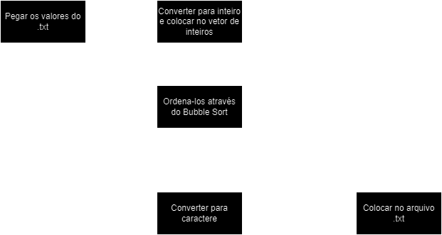

# ProjetoAssembly

  ### Projeto de ordenação com assembly MIPS

    Objetivo: Pegar valores dentro de um arquivo .txt, ordenar(Utilizando qualquer método) e colocar ordenado dentro de outro .txt

  ### Etapas para o projeto

  
  
  ## Programadores:
  
<strong>Getulio: link</strong>

  
<strong>Guilherme: link</strong>

